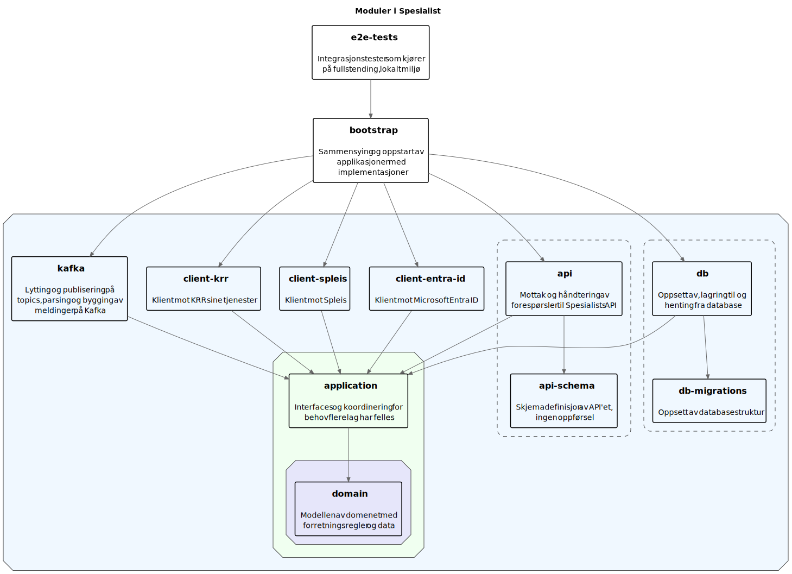

# Spesialist


## Beskrivelse

Backend for saksbehandling av sykepengesøknader

## Moduler

Spesialist er inndelt i moduler etter lag i en onion architecture.

Alle lag på samme nivå har kun avhengighet og kjennskap til lag på nivå innenfor seg selv. De har ikke kjennskap til lag
på samme nivå, eller nivåer utenfor.

Modulene og deres avhengigheter:



## Komme i gang

### Gradleoppsett

#### Ktlint

Vi bruker [Ktlint](https://github.com/pinterest/ktlint) for linting av koden, for å sette dette opp må man kjøre
følgende kommando:

```shell
./gradlew addKtlintFormatGitPreCommitHook
```

Det holder å kjøre kommandoen en gang, så er commithooken satt opp for fremtidige commits.

### Docker

For å kjøre tester trenger du docker. Du kan enten installere klienten fra [docker](https://www.docker.com/) eller bruke
colima.

#### Colima

```shell
brew install colima docker
```

For at colima skal virke må disse env variablene settes opp i `~/.zshrc`:

```shell
export TESTCONTAINERS_DOCKER_SOCKET_OVERRIDE=/var/run/docker.sock
export DOCKER_HOST=unix://$HOME/.colima/default/docker.sock
```

```shell
colima start
```

## Kjøre lokal Swagger UI

- Kjør opp [LocalApp.kt](spesialist-bootstrap/src/test/kotlin/no/nav/helse/spesialist/bootstrap/LocalApp.kt) sin main-metode, det starter en lokal server.
- Gå til http://localhost:8080/api/swagger i en nettleser
- Søk etter "OAuth2-token" i oppstartsloggen, kopier tokenet som står under og lim det inn under "Authorize"-knappen i Swagger UI
- Requests kan nå kjøres mot lokal instans via "Try it out"

## Kjøre tester raskere

- Finn filen .testcontainers.properties, ligger ofte på hjemmeområdet ditt, eksempelvis `~/.testcontainers.properties`
- Legg til denne verdien: `testcontainers.reuse.enable=true`

## Oppgradering av gradle wrapper

- Finn nyeste versjon av gradle her: https://gradle.org/releases/
- Kjør `./gradlew wrapper --gradle-version <versjon> && ./gradlew wrapper` - ja, den skal kjøres to ganger, ref. [dokumentasjonen til Gradle](https://docs.gradle.org/current/userguide/gradle_wrapper.html#sec:upgrading_wrapper).

## Spesialist-opprydding-dev

En selvstendig app for å slette testpersoner, kjører kun i dev.

Spleis-testdata fyrer av et kafka-event som spesialist-opprydding-dev lytter på og sletter testpersoner.

## Henvendelser

Spørsmål knyttet til koden eller prosjektet kan stilles som issues her på GitHub.

### For NAV-ansatte

Interne henvendelser kan sendes via Slack i
kanalen [#team-bømlo-værsågod](https://nav-it.slack.com/archives/C019637N90X).

## Kode generert av GitHub Copilot

Dette repoet bruker GitHub Copilot til å generere kode.
